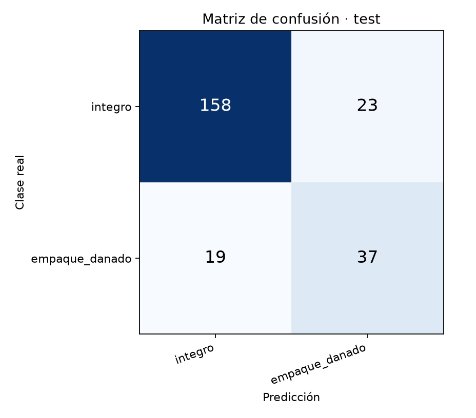

# Prueba temprana · actividad 25

## Dataset y configuración

Se usó el [dataset preparado](../CONTEO_DATASET.md), con partición por paquete y fuente. `train`: 1187 imágenes; `val`: 279; `test`: 237. La semilla fue 42. TensorFlow 2.21.0.

MobileNetV2 con pesos ImageNet y base congelada; `GlobalAveragePooling2D` → `Dropout(0.2)` → `Dense(2, softmax)`. Entrada 224×224 con `preprocess_input`. Sólo durante entrenamiento hubo volteo horizontal y rotación leve (factor 0.03). Adam 1e-3, máximo 10 épocas, `EarlyStopping` por `val_loss`, paciencia 3 y restauración de los mejores pesos. Se completaron 8 épocas en **167.8 s**. Pesos calculados sólo con `train`: `integro` 0.6287, `empaque_danado` 2.4424. La corrida completa tardó 189.9 s. El detalle reproducible está en `salidas/corrida.log` (fuera de Git).

## Evaluación en `test` únicamente

**Exactitud global: 0.8228 (195/237).**

| Clase | Soporte | Precisión | Exhaustividad | F1 |
|---|---:|---:|---:|---:|
| `integro` | 181 | 0.8927 | 0.8729 | 0.8827 |
| `empaque_danado` | 56 | 0.6167 | 0.6607 | 0.6379 |

Matriz de confusión (filas: clase real; columnas: predicción):

| Real \ predicción | `integro` | `empaque_danado` |
|---|---:|---:|
| `integro` | 158 | 23 |
| `empaque_danado` | 19 | 37 |

| Fuente | Total `test` | Correctas | Exactitud global | `integro` | `integro` correctas | Exactitud de `integro` |
|---|---:|---:|---:|---:|---:|---:|
| corrugated | 136 | 94 | 0.6912 | 80 | 57 | 0.7125 |
| tampar | 101 | 101 | 1.0000 | 101 | 101 | 1.0000 |

TAMPAR sólo aporta ejemplos `integro`; por eso su exactitud global coincide con su exactitud de `integro`. **Se observó la señal de sesgo de fuente A27:** TAMPAR fue perfecto (101/101), mientras Corrugated obtuvo 94/136 (69.1%). El modelo parece aprender rasgos de la fuente además del daño; la exactitud global de 82.28% no representa el rendimiento en una fuente nueva. La prueba no mide identificación de daño físico en TAMPAR.

## Exportación a TensorFlow Lite

Se exportó `salidas/vixta_prueba_temprana.tflite` con cuantización de rango dinámico mediante `from_keras_model`. **Tamaño: 2,535,720 bytes (2.42 MiB). Latencia media: 36.14 ms** por inferencia, medida en 50 invocaciones tras 5 de calentamiento, con el intérprete TFLite local y un hilo. Esta latencia describe esta computadora; no mide un teléfono Android.

## Alcance y siguiente paso

Ésta es una línea base de **2 de las 4 clases** con fotos públicas de paquetería, no de cadena de frío. La exactitud en `test` mide esas fuentes y ese corte por paquete; no demuestra rendimiento en los empaques reales de Vixta ni en contaminación o etiquetas ilegibles. La actividad 26 incorporará las cuatro clases con el dataset propio. El archivo TFLite abre la actividad 28 de integración y medición en el dispositivo.
